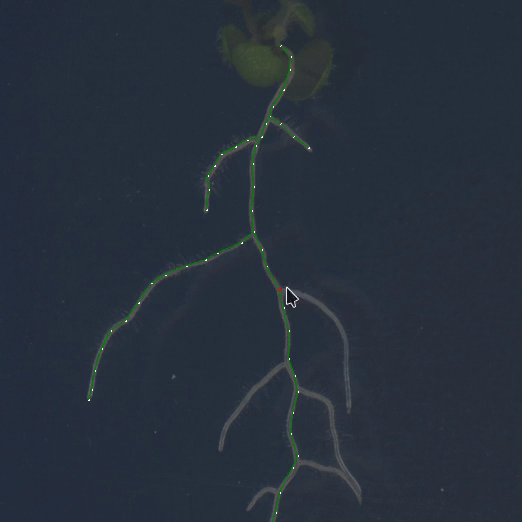
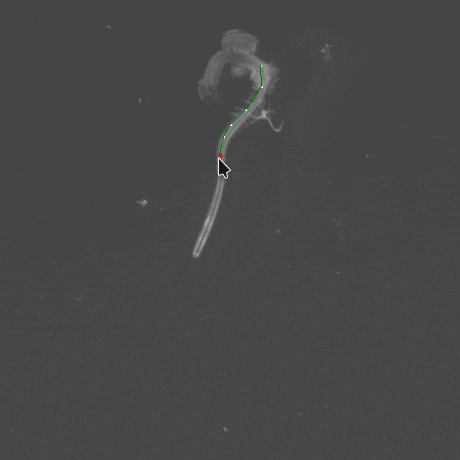
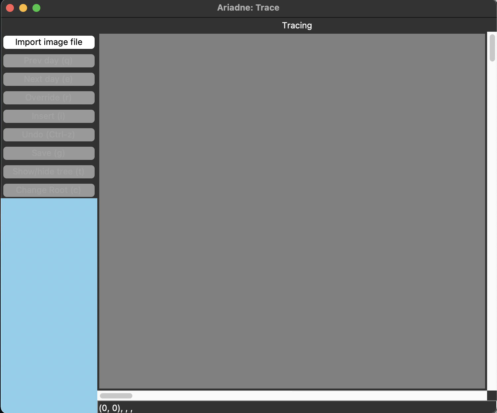
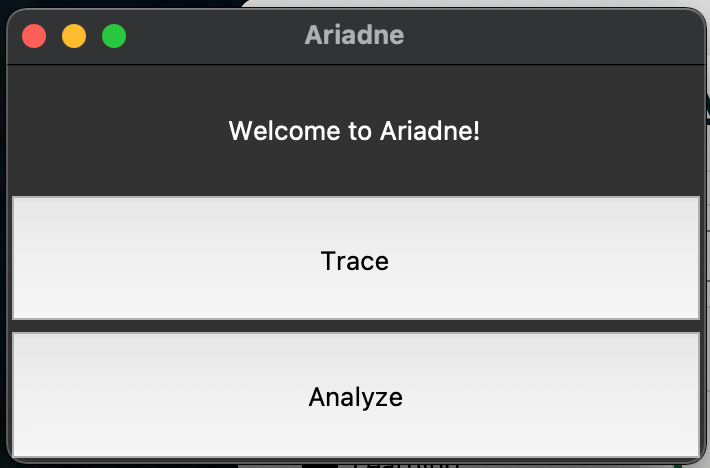

# Ariadne
🌱 is a small software package for analyzing images of _Arabidopsis thaliana_ roots.

📷 It features a GUI for semi-automated image segmentation



⏰ with support for time-series GIFs



☠️ that creates dynamic 2D skeleton graphs of the root system architecture (RSA).

🔍 It's designed specifically to handle complex, messy, and highly-branched root systems well — the same situations in which current methods fail.

📊 It also includes some (very cool) algorithms for analyzing those skeletons, which were mostly developed by other (very cool) people<sup id="a1">[1](#f1)</sup><sup>,</sup><sup id="a2">[2](#f2)</sup>. The focus is on measuring cost-performance trade-offs and Pareto optimality in RSA networks.

⚠️ This is very much a work-in-progress! These are custom scripts written for an ongoing research project — so all code is provided as-is.

🔨 That said, if you're interested in tinkering with the code, enjoy! PRs are always welcome. And please reach out with any comments, ideas, suggestions, or feedback.

## Installation

Ariadne is installed as a Python package called `ariadne-roots`. We recommend using a package manager and creating an isolated environment for `ariadne-roots` and its dependencies. Our recommended package manager is Mamba. Follow the instructions to install [Miniforge3](https://github.com/conda-forge/miniforge).

You can find the latest version of `ariadne-roots` on the [Releases](https://github.com/Salk-Harnessing-Plants-Initiative/Ariadne/releases) page.

### Step-by-Step Installation

1. **Create an isolated environment:**
    ```sh
    mamba create --name ariadne python=3.11
    ```

2. **Activate your environment:**
    ```sh
    mamba activate ariadne
    ```

3. **Install `ariadne-roots` using pip:**
    ```sh
    pip install ariadne-roots
    ```

## Usage

1. **Activate your environment:**
    ```sh
    mamba activate ariadne
    ```

2. **Open the GUI:**
    ```sh
    ariadne-trace
    ```


### Trace with Ariadne

1. **Click on “Trace”** to trace roots.
2. The following window should open:

    

3. **Click on “Import image file”** and select the image to trace the roots.
4. **Select the zoom factor for your image** 
    - A window should popup asking for the zoom factor
    - Use the "Zoom in" and Zoom out" button to adjust the zoom needed to trace the root system with high precision
    - Click on "OK"
    - After this, any new image imported will be opened with the identical zoom factor
    - Remark: after closing Ariadne, the zoom factor will be canceled. Therefore, take note of the zoom factor used and reapply the same everytime when restarting Ariadne.
5. **Trace the first root:**
    - Start tracing the entire primary root first (it should appear green).
    - To save time, place a dot on each region where a lateral root is emitted.
6. **Save the traced root:**
    - When the first root is fully traced, click on the “Save” button on the left-hand menu of Ariadne or press “g” on your keyboard.
    - A new window will pop up asking for the plant ID. Tap any letter “A” or number "1".
        - Each time you click on “Save”, a .json file will be saved in the folder at the location of Location_1 (see above).
7. **Trace additional roots:**
    - When you are done tracing the first root, click on the “Change root” button on the left-hand menu of Ariadne.
    - Select a new plant ID, like “B”, to trace the second root.
    - Continue tracing each root on your image following these steps.
8. **Finish tracing:**
    - When you have traced all roots on your image, click on “Change root” and repeat from “Step 3” above for any new images.

### Analyze with Ariadne

1. **Organize your files:**
    - Gather all the .json files stored at the location where Ariadne has been installed into a new folder named “OUTPUT_JSON” (referred to as “location_1” later on).
    - Create a folder named “RESULTS” (referred to as “location_2”).
    - Create a new folder named “Output”.
2. **Prepare for analysis:**
    - Close Ariadne but keep the terminal open.
    - Follow the instructions in step 2 above to set up the terminal.
3. **Run the analysis:**
    - Click on “Analyze” in Ariadne.

    

    - Select the .json files to analyze from “location_1”.
    - Then select “location_2” for the output.
    - The software will analyze all the selected .json files.

### Results

- In the “location_3” folder, you will find:
    - A graph for each root showing the Pareto optimality.
    - A .csv file storing all the RSA traits for each root.

The RSA traits included in the CSV are

- **Total root length:** Total root length
- **Travel distance:** Sum of the length from the hypocotyl to each root tip (Pareto related trait)
- **Alpha:** Trade-off value between growth and transport efficiency (Pareto related trait)
- **Scaling distance to front:** Pareto optimality value (Pareto related trait)
- **Total root length (random):** Random total root length
- **Travel distance (random):** Random sum of the length from the hypocotyl to each root tip (Pareto related trait)
- **Alpha (random):** Random trade-off value between growth and transport efficiency (Pareto related trait)
- **Scaling distance to front (random):** Random Pareto optimality value (Pareto related trait)
- **PR length:** Length of the primary root
- **PR minimal length:** Euclidean distance from the hypocotyl to the primary root tip
- **Basal zone length:** length from the hypocotyl to the insertion of the first lateral root along the primary root 
- **Branched zone length:** length from the insertion of the first lateral root to the insertion of the last lateral root along the primary root 
- **Apical zone length:** length from the last lateral root to the root tip along the primary root 
- **Mean LR lengths:** Average length of all lateral roots
- **Mean LR minimal distances:** Average Euclidean distance between each lateral root tip and its insertion on the primary root for all lateral roots
- **Median LR lengths:** Median length of all lateral roots
- **Median LR minimal distances:** Median Euclidean distance between each lateral root tip and its insertion on the primary root for all lateral roots
- **Sum LR minimal distances:** Sum of the Euclidean distances between each lateral root tip and its insertion on the primary root for all lateral roots
- **Mean LR angles:** Average lateral root set point angles
- **Median LR angles:** Median lateral root set point angles
- **LR count:** Number of lateral roots
- **LR density:** Number of lateral roots divided by primary root length
- **Branched zone density:** Number of lateral roots divided by Branched zone length
- **LR lengths:** Length of each individual lateral root
- **LR angles:** Lateral root set point angle of each individual lateral root
- **LR minimal distance:** Euclidean distance between each lateral root tip and its insertion on the primary root for each lateral root
- **Barycentre x displacement:** Vertical distance between the hypocotyl base to the barycenter of the convex hull
- **Barycentre y displacement:** Horizontal distance between the hypocotyl base to the barycenter of the convex hull
- **Total minimal distance:** Sum of LR minimal distances plus PR minimal length
- **Tortuosity (Material/Total Distance Ratio):** Total root length divided by total minimal distance


##### Keybinds
* `Left-click`: place/select node. 
* `Ctrl`: Hold Ctrl to scroll through the image with the mouth
* `t`: toggle skeleton visibility (default: on)
* `e`: next frame (GIFs only)
* `q`: previous frame (GIFs only)
* `r`: toggle proximity override. By default, clicking on or near an existing node will select it. When this override is on, a new node will be placed instead. Useful for finer control in crowded areas (default: off)
* `i`: toggle insertion mode. By default, new nodes extend a branch (i.e., have a degree of 1). Alternatively, use insertion mode to intercalate a new node between 2 existing ones. Useful for handling emering lateral roots in regions you have already segmented (default: off)
* `g`: Save output file
* `d`: Delete currently selected node(s)
* `c`: Erase the current tree and ask for a new plant ID
* `+`: Zoom in
* `-`: Zoom out
* `Ctrl-Z`: Undo last action


## Contributing
Follow these steps to set up your development environment and start making contributions to the project.

1. **Navigate to the desired directory**

    Change directories to where you would like the repository to be downloaded
    ```sh
    cd /path/on/computer/for/repos
    ```

2. **Clone the repository**
    ```sh
    git clone https//github.com/Salk-Harnessing-Plants-Initiative/Ariadne.git
    ```

3. **Navigate to the root of the cloned repository**
    ```sh
    cd Ariadne
    ```

4. **Create a development environment**

    This will install the necessary dependencies and the `ariadne-roots` package in editable mode
    ```sh
    mamba env create -f environment.yaml
    ```

5. **Activate the development environment**
    ```sh
    mamba activate ariadne_dev
    ```

6. **Create a branch for your changes**

    Before making any changes, create a new branch
    ```sh
    git checkout -b your-branch-name
    ```

7. **Code**

    Make your changes. Please make sure your code is readable and documented.

    - The Google style is preferred.
    - Use docstrings with args and returns defined for each function.
    - Typing annotations are preferred.
    - Use comments to explain steps of calculations and algorithms.
    - Use consistent variable names.
        - Please use full words and not letters as variable names so that variables are readable.


8. **Commit often**

    Commit your changes frequently with short, descriptive messages. This helps track progress and makes it easier to identify issues.

    ```sh
    git add <changed_files>
    git commit -m "Short, descriptive commit message"
    ```

9. **Open a pull request**

    Before you make any changes, you can write a descriptive plan of what you intend to do and why.
    Once your changes are ready, push your branch to the remote repository. Provide a clear explanation of what you changed and why.

    ```sh
    git push origin your-branch-name
    ```

    - Go to the repository on GitHub.
    - Click on **Compare & pull request**.
    - Fill in the title and description of your pull request.
    - Click **Create pull request**.

10. **Test your changes**

    Ensure your changes pass all tests and do not break existing functionality.

11. **Request a review**

    In the pull request, request a review from the appropriate team members. Notify them via GitHub.

12. **Merge your changes to main**

    After your code passes review, merge your changes to the `main` branch.

    - Click **Merge pull request** on GitHub.
    - Confirm the merge.

13. **Delete your remote branch**

    Once your changes are merged, delete your remote branch to keep the repository clean.


## Releasing `ariadne-roots`

The GitHub Action workflow `.github/workflows/python-publish.yml` results in the package, `ariadne-roots`, being released at [PyPI](https//pypi.org/project/ariadne-roots/).

To release a new package, follow these instructions:

### Follow contributing instructions above

1. **Make a new branch to record your changes**
    ```sh
    git checkout -b <your_name>/bump_version_to_<version>
    ```

### Modify version

The `pyproject.toml` file contains the information for the pip package. Incrementally increase the "version" with each release.

#### Semantic Versioning

Semantic versioning (SemVer) is a versioning system that uses the format:
`MAJOR.MINOR.PATCH`

- **MAJOR:** Increase when you make incompatible API changes.
- **MINOR:** Increase when you add functionality in a backward-compatible manner.
- **PATCH:** Increase when you make backward-compatible bug fixes.

For example:

- If the current version is `1.2.3`:
  - A breaking change would result in `2.0.0`.
  - Adding a new feature would result in `1.3.0`.
  - Fixing a bug would result in `1.2.4`.

Learn more about the rules of semantic versioning [here](https://semver.org).

### Commit changes

After making the required modifications:
```sh
git add pyproject.toml
git commit -m "Bump version to <version>"
git push origin <your_name>/bump_version_to_<version>
```

### Open a pull request

1. Go to the repository on GitHub.
2. You should see a banner prompting you to compare & create a pull request for your branch. Click it.
3. Fill in the pull request title and description. For example:
    - **Title:** Bump version to `<version>`
    - **Description:** "This PR updates the version to `<version>` for release."
4. Click **Create pull request**.

### Request a review

After creating the pull request, in the right-hand sidebar, click on **Reviewers** and select the appropriate reviewer(s). Notify the reviewer(s) via GitHub.

### Merge your changes to `main` after review

Once the reviewer approves your pull request, merge it into the `main` branch.

### Release to trigger the workflow

1. Go to the [release page](https://github.com/Salk-Harnessing-Plants-Initiative).
2. Draft a new release:
    - Create a new tag with the version number you used in the repository.
    - Have GitHub draft the release notes to include all the changes since the last release.
    - Modify the release name to include `ariadne-roots`, so that it says `ariadne-roots v<version>` like the rest.
3. Please ask for your release to be reviewed before releasing.

### Verify the release

Check [PyPI](https://pypi.org/project/ariadne-roots/#history) and the GitHub Actions of our repository to make sure the pip package was created and published successfully.
    - You should see the latest release with the correct version number at pypi.org.
    - The Github Actions should have green checkmarks and not red X's associated with your release.

## Contributors

- Kian Faizi
- Matthieu Platre
- Elizabeth Berrigan

## Contact

For any questions or further information, please contact:

- **Matthieu Platre:** [matthieu.platre@inrae.fr](mailto:matthieu.platre@inrae.fr)


## References
<b id="f1">1.</b> Chandrasekhar, Arjun, and Navlakha, Saket. "Neural arbors are Pareto optimal." _Proceedings of the Royal Society B_ 286.1902 (2019): 20182727. https://doi.org/10.1098/rspb.2018.2727 [↩](#a1)

<b id="f2">2.</b> Conn, Adam, et al. "High-resolution laser scanning reveals plant architectures that reflect universal network design principles." _Cell Systems_ 5.1 (2017): 53-62. https://doi.org/10.1016/j.cels.2017.06.017 [↩](#a2)
