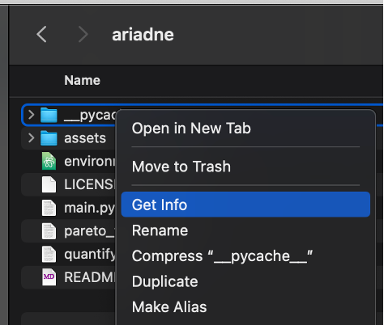
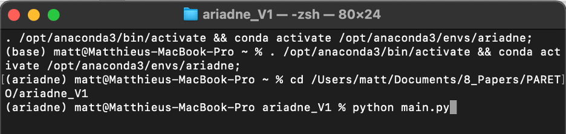

# Ariadne
🌱 is a small software package for analyzing images of _Arabidopsis thaliana_ roots.

📷 It features a GUI for semi-automated image segmentation


⏰ with support for time-series GIFs


☠️ that creates dynamic 2D skeleton graphs of the root system architecture (RSA).

🔍 It's designed specifically to handle complex, messy, and highly-branched root systems well — the same situations in which current methods fail.

📊 It also includes some (very cool) algorithms for analyzing those skeletons, which were mostly developed by other (very cool) people<sup id="a1">[1](#f1)</sup><sup>,</sup><sup id="a2">[2](#f2)</sup>. The focus is on measuring cost-performance trade-offs and Pareto optimality in RSA networks.

⚠️ This is very much a work-in-progress! These are custom scripts written for a small, ongoing research project — so all code is provided as-is.

🔨 That said, if you're interested in tinkering with the code, enjoy! PRs are always welcome. And please reach out with any comments, ideas, suggestions, or feedback.

## Installation

1)	Install anaconda from this website:
```
https://www.anaconda.com/download/success
```
-	Make sure you install the correct version according to your operating system.
-	After installation make sure you are running the latest Anaconda version. If not do the update.
2)	Download Ariadne
```
https://github.com/Salk-Harnessing-Plants-Initiative/Ariadne
```
-	Click on the “<> Code” button highlighted in green
-	Click on download zip
-	Place the zip folder where you’d like to store Ariadne
-	Unzip it
-	Delete the zipped version
3)	Installation of Ariadne
-	Open Anaconda navigator
-	Click on ”Environments” top left
-	Click on “import” bottom left
-	Give a new name to the environment named “Ariadne”
-	Click on the small folder icon on the right of “Specification file”
-	Retrieve the location of Ariadne folder ( the oneyou just downloaded and unzipped) and click on the file “environment.yaml” located inside the folder.
-	The installation is now running.
-	When the installation is done you should see a new Folder created named “Ariadne” (see below)


4)	STEP1 Run Ariadne to trace roots
-	Once the installation is done you can now run Ariadne
-	Open Anaconda Navigator
-	Click on ”Environments” top left
-	Click on the play button right next to the “Ariadne”
-	Click on open terminal (seebelow)


-	A terminal where you’ll need to tap few lines of code will pop up.
-	Retrieve the location where you stored Ariadne and do right click on the “__pycache “folder and click on the “get info” (See below)


-	Copy the location of the folder where Ariadne is stored. See below


-	Go back to the terminal, tap “cd” and paste the location (Location_1). See below.


-	Click on enter
-	Step 2: Then in the terminal tap:
```
python main.py
```



### Trace with Ariadne

-	Click on “Trace” to trace Roots.
-	The window below should be opened now:


-	Step 3 : Click on “Import image file”
-	Select the image to trace the roots
-	Trace the root number 1. 
        * Caution start to trace the entire primary root first (should appear green). To gain time place a dot on each region where a lateral root is emitted. 
-	When the first root is all traced click on “Save” button on the left-hand menu of Ariadne or tap “g” on your keyboard.
-	A new window will pop up asking for the plant ID, for the first plant say “A”
        * Every time you’ll click on “Save” a .json file will be saved in the folder at the location of Location_1 (see above).
-	When you are done tracing the first root, click on “change root” button on the left-hand menu of Ariadne
-	Select a new plant ID, like “B” for example to trace the root number 2.
-	Continue like that until you traced every root on your image. 
-	When you are done tracing all roots on your image click on “change root” and restart from “Step 3” indicated above.

#### Analyze with Ariadne
-	Ideally, gather all the .json stored in ”location_1” into a new Folder named “OUTPUT_JSON” for example, refereed as “location_2” later on.
-	Create a file named for example named “RESULTS”, refereed as “location_3”
-	Create a new folder named Output. 
-	Close Ariadne but keep the terminal open.
-	On the terminal do the step 2, see above.
-	Click on analyze 


-	Select the .json file to analyze which are stored at the  “location_2”.
-	Then select the location_3
-	The software is now running to analyze all the .json files selected. 
6)	Results analysis
-	In the location_3 folder, you’ll find a graph for each root where the Pareto optimality will be represented.
-	You’ll find a .csv file where all the RSA traits will be store for each root.
-	Each column contains the calculation for:
o	Material cost = total root length
o	Wiring cost = Sum of the length from the hypocotyl to each root tip (pareto related trait)
o	Alpha = trade off value between growth and transport efficiency (pareto related trait)
o	Scaling distance from the from the front =Pareto optimality value(pareto related trait)
o	Material cost (random) = random total root length
o	Wiring cost (random) = random Sum of the length from the hypocotyl to each root tip (pareto related trait)
o	Alpha (random) = random trade off value between growth and transport efficiency (pareto related trait)
o	Scaling distance from the from the front (random) = random Pareto optimality value(pareto related trait)
o	Mean LR lengths = average of the length of all lateral roots
o	Median LR lengths = Median of the length of all lateral roots
o	Mean LR angles = average of lateral root set point angles 
o	Median LR angles = Median of lateral root set point angles
o	Mean LR minimal distances = average of the Euclidian distance between each lateral root tips to their insertion on the primary root for all the lateral roots.
o	Median LR minimal distances = median of the Euclidian distance between each lateral root tips to their insertion on the primary root for all the lateral roots.
o	Sum LR minimal distances = Sum of the Euclidian distance between each lateral root tips to their insertion on the primary root for all the lateral roots.
o	PR minimal length = Euclidean distance between the hypocotyl to the primary root tip.
o	PR length = length of the lateral root
o	LR count = number of lateral root
o	LR lengths = length of each individual lateral root
o	LR angles = lateral root set point angle of each individual lateral root
o	LR minimal distance = Euclidian distance between each lateral root tips to their insertion on the primary root for each lateral roots
o	LR density = number of lateral root divided by PR length * 100
o	Total minimal distance = Sum LR minimal distances plus PR minimal length
o	Material/TotalDistance Ratio = Total root length / Total minimal distance
7)	When you are done close everything
8)	To restart Ariadne for tracing or analysing start from STEP 1.


##### Keybinds
* `Left-click`: place/select node. To pan, hold `Alt` or `Ctrl` and drag
* `t`: toggle skeleton visibility (default: on)
* `e`: next frame (GIFs only)
* `q`: previous frame (GIFs only)
* `r`: toggle proximity override. By default, clicking on or near an existing node will select it. When this override is on, a new node will be placed instead. Useful for finer control in crowded areas (default: off)
* `i`: toggle insertion mode. By default, new nodes extend a branch (i.e., have a degree of 1). Alternatively, use insertion mode to intercalate a new node between 2 existing ones. Useful for handling emering lateral roots in regions you have already segmented (default: off)
* `g`: Save output file
* `d`: Delete currently selected node(s)
* `c`: Erase the current tree and ask for a new plant ID
* `Ctrl-Z`: Undo last action


## References
<b id="f1">1.</b> Chandrasekhar, Arjun, and Navlakha, Saket. "Neural arbors are Pareto optimal." _Proceedings of the Royal Society B_ 286.1902 (2019): 20182727. https://doi.org/10.1098/rspb.2018.2727 [↩](#a1)

<b id="f2">2.</b> Conn, Adam, et al. "High-resolution laser scanning reveals plant architectures that reflect universal network design principles." _Cell Systems_ 5.1 (2017): 53-62. https://doi.org/10.1016/j.cels.2017.06.017 [↩](#a2)

### Acknowledgments
Matt (for guidance, ideas, and support); Illia (for technical advice); Tosh (for late-night debugging help)
